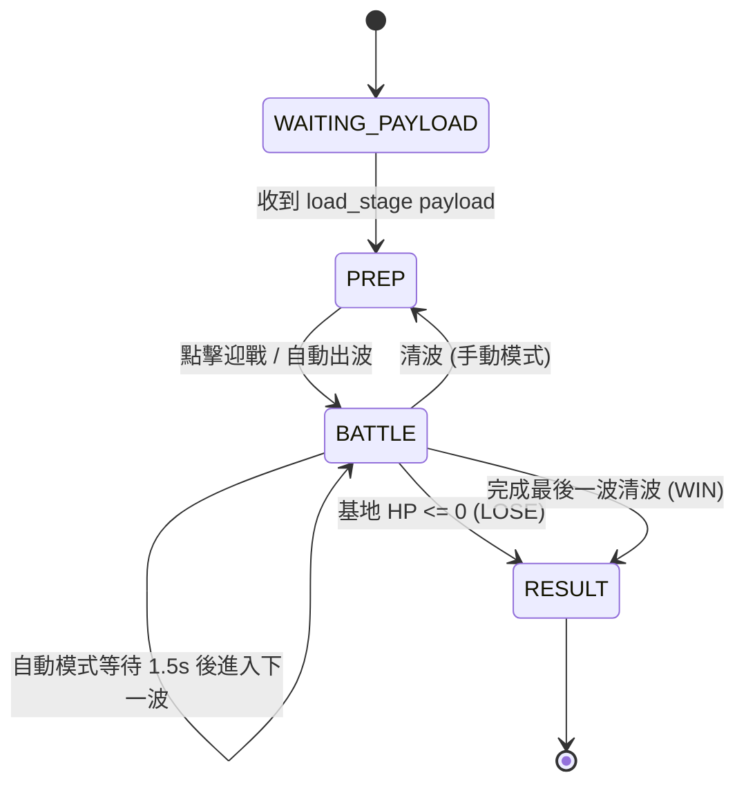

# 神馬三國（純 JS / HTML5 Canvas 2D 版）極致機制規格白皮書
## Exhaustive Mechanics Specification & Single Source of Truth

> **版本**：1.0.0 (對齊 Godot 原始碼 `WebBridge` Protocol 7 與 58 個回歸測試案例)  
> **狀態**：極致確認完畢（Verified & Finalized）  
> **目標**：100% 精準復刻原本神馬三國之所有玩法、數學公式、狀態機、邊界防禦與事件協議，替換掉 Godot 4.6 WebAssembly (39MB) 引擎。

---

## 1. 核心視窗、座標系與地圖規格 (GameMap)

### 1.1 解析度與視口 (Resolution & Stage Anchor)
- **基準邏輯解析度**：固定寬度 `GAME_VIEW_W = 540`，高度 `GAME_VIEW_H = 720`。
- **渲染比率縮放 (Uniform Scaling)**：
  $$k = \min\left(\frac{\text{containerWidth}}{540}, \frac{\text{containerHeight}}{720}\right)$$
- **畫布居中與黑邊 (Letterbox Offset)**：
  $$\text{offsetX} = \frac{\text{containerWidth} - 540 \times k}{2}, \quad \text{offsetY} = \frac{\text{containerHeight} - 720 \times k}{2}$$
- **網格大小**：標準瓦片大小為 `tile_size = 48` 像素。
- **動態網格計算**：
  若關卡定義未指定，或為響應式計算：
  $$\text{tile\_size} = \max\left(16, \min\left(\left\lfloor \frac{540}{\max(1, \text{map\_cols})} \right\rfloor, \left\lfloor \frac{720}{\max(1, \text{map\_rows})} \right\rfloor\right)\right)$$

### 1.2 座標轉換數學 (Coordinate Transforms)
- **網格座標 $\to$ 世界邏輯像素座標**：
  $$\text{worldX} = \text{offsetX} + \left(\text{col} + 0.5\right) \times \text{tile\_size}$$
  $$\text{worldY} = \text{offsetY} + \left(\text{row} + 0.5\right) \times \text{tile\_size}$$
- **世界邏輯像素座標 $\to$ 網格座標**：
  $$\text{col} = \left\lfloor \frac{\text{worldX} - \text{offsetX}}{\text{tile\_size}} \right\rfloor, \quad \text{row} = \left\lfloor \frac{\text{worldY} - \text{offsetY}}{\text{tile\_size}} \right\rfloor$$
- **合法格子判定**：
  $$0 \le \text{col} < \text{map\_cols} \quad \land \quad 0 \le \text{row} < \text{map\_rows}$$

### 1.3 瓦片類型與放置規則 (Tile Types & Placement)
| 瓦片枚舉 | 數值 | 說明 | 可放置武將 | 可放置防禦塔 | 阻擋地面敵人 | 額外效果 |
| :--- | :---: | :--- | :---: | :---: | :---: | :--- |
| `EMPTY` | 0 | 背景草地/空地 | ❌ | ❌ | ❌ | 無 |
| `ROAD` | 1 | 敵人行進道路 | ✅ (近戰/阻擋) | ❌ | ✅ (地面) | 武將阻擋並造成 30% 緩速 |
| `BUILD` | 2 | 建築高台/陣地 | ✅ (遠程) | ✅ | ❌ | 遠程輸出，不受阻擋近戰攻擊 |
| `OBSTACLE`| 3 | 障礙物/裝飾物 | ❌ | ❌ | ❌ | 阻礙視野或地形裝飾 |
| `BASE` | 4 | 玩家基地城池 | ❌ | ❌ | ❌ | 敵人抵達時扣除基地 HP |
| `SPAWN` | 5 | 怪物出生點 | ❌ | ❌ | ❌ | 路線起點標記 |

- **放置限制**：
  - 格子不可被其他單位佔用 (`_occupied[cell] == null`)。
  - 同一名武將在同一場戰鬥中只能放置一個 (`_placed_heroes[hero_id] == null`)，除非是移位 (`reposition`)。
  - 建造防禦塔必須扣除對應的金幣，金幣不足不可建造。
- **單位移位 (Reposition)**：
  - 僅在 `PREP`（備戰期）允許移位。
  - 拖曳距離閥值：`DRAG_THRESHOLD = 8.0px`。
  - 移位成功後釋放舊格子、佔用新格子，並重置阻擋狀態。

---

## 2. 戰鬥狀態機與數值結算 (BattleManager)

### 2.1 遊戲狀態生命週期

### 2.2 核心戰鬥常數
- **基地初始生命**：`MAX_BASE_HP = 20`
- **敵人洩漏扣除**：每隻敵人抵達基地扣除 `1` 點基地生命（不論敵人種類與攻擊力）。
- **初始戰鬥金幣**：`INITIAL_GOLD = 5000`
- **擊殺金幣獎勵**：每擊殺 1 隻敵人固定獎勵 `+5` 金幣 (`GOLD_PER_KILL = 5`)。
- **自動下一波延遲**：清波後延遲 `AUTO_NEXT_WAVE_DELAY = 1.5` 秒。
  - 使用 Token 與 Lifecycle 保護：切換關卡或同關重啟時令牌遞增，舊計時器回調自動作廢。
- **時間縮放控制**：
  - 玩家速度偏好：`speed_pref` 可選 `1x` 或 `2x`。
  - 部署選單子彈時間：點擊空地開啟選單時，時間倍率強制壓低至 `DEPLOY_TIME_SCALE = 0.1`。
  - 關閉部署選單時恢復玩家選擇之速度。
  - 手動暫停 (`manual_paused`)：凍結所有單位邏輯與計時器，但倍率變數與 UI 保持獨立。

### 2.3 勝負與星數計算公式
- **落敗判定**：`base_hp <= 0` $\implies$ 0 星，固定獲得戰鬥點數 `10`，經驗 `10`。
- **勝利判定**：`current_wave >= total_waves` 且怪物全部清空。
  - 失去生命值：$\Delta \text{HP} = \text{MAX\_BASE\_HP} - \text{base\_hp}$
  - **星數分級**：
    $$\text{Stars} = \begin{cases} 3, & \text{若 } \Delta \text{HP} \le 2 \\ 2, & \text{若 } 3 \le \Delta \text{HP} \le 10 \\ 1, & \text{若 } \Delta \text{HP} > 10 \end{cases}$$
  - **戰鬥點數獎勵 (Battle Points)**：
    $$\text{Points} = (\text{kills} \times 10) + (\text{base\_hp} \times 20) + \text{StarBonus}$$
    其中 $\text{StarBonus}$: 1星為 100，2星為 300，3星為 600。
  - **角色經驗獎勵**：
    $$\text{Exp} = 50 + (\text{Stars} \times 20)$$

---

## 3. 波次規劃與路線驗證 (WaveManager)

### 3.1 路線合法性與 Wave Rejection 邊界檢查
在進入 `BATTLE` 前，必須先調用 `plan_wave(wave_num)` 驗證。若整波無任何合法組，觸發 `wave_start_rejected`，退回 `PREP`，不扣城血、不結算：

| 檢查項目 | 略過原因代碼 | 判定條件 |
| :--- | :--- | :--- |
| 敵人設定不存在 | `enemy_not_found` | `enemies_config` 查無此 `enemy_id` |
| 路徑為空 | `path_empty` | 路徑點陣列長度為 0 |
| 飛行路線單點 | `flight_single_point` | 飛行怪物之路線點數 $< 2$ |
| 飛行路線同起終點 | `flight_same_endpoints` | 飛行怪物起點至終點直線距離 $\le 0.001\text{px}$ |
| 地面路線單點 | `ground_single_point` | 地面怪物之路線點數 $< 2$ |
| 地面路線總長為零 | `ground_zero_length` | 沿全部路點之折線累積總長 $\le 0.001\text{px}$（環狀路線中途有折線則合法） |
| 數量無效 | `count_invalid` | `count <= 0` |

### 3.2 出怪時序與群組管理
- 支援同一波多路線、多群組並行生成（例如上路步兵、下路騎兵同時進攻）。
- 出怪間隔使用 `interval` 秒，支持以固定時間步進倒數。
- 每隻怪物生成時賦予遞增唯一序號 `spawn_seq`（從 0 起算）。

---

## 4. 敵人運動與戰鬥系統 (Enemy)

### 4.1 移動物理與路徑演算
- **地面敵人 (`movement_type = "ground"`)**：
  - 嚴格依照路點折線行走：目前位置到下一個路點 $\to$ 抵達後轉向下一節。
  - 剩餘路程 $\text{RemainingDist}$：當前點到下個路點距離 $+$ 下個路點到終點折線累加長度。
- **飛行敵人 (`movement_type = "flying"`)**：
  - 忽略中間轉折點，從起點直線飛往終點。
  - 不受地面武將阻擋，不觸發近戰搏鬥。
  - 視覺呈現：陰影在地面，主體上浮 $0.45 \times \text{radius}$，兩側帶翅膀。
  - 剩餘路程 $\text{RemainingDist}$：當前點到終點直線距離。

### 4.2 減速系統疊加數學 (Slow Mechanics)
敵人身上的減速包含兩套機制：
1. **多來源倍率減速 (`_slow_sources`)**：
   - 包含：武將道路阻擋（0.30）、步兵塔緩速光環（0.55）、關羽減速光環（0.90）。
   - 每個來源保存 `{ mult, left_ttl }`，刷新時間 `TTL = 0.5s`。
   - **取最強原則（不相乘、不累加）**：
     $$\text{speed\_mult} = \min_{s} (s.\text{mult})$$
2. **文士塔疊加減速 (`_stack_slow_amount`)**：
   - 每次文士塔擊中疊加 $0.05$（升級每次 $+0.02$），持續時間刷新為 $3.5\text{s}$。
   - 疊加上限：最大減速 $85\%$（即 `_stack_slow_amount` $\le 0.85$）。
3. **免疫減速特性 (`trait = "immune_slow"`)**：
   - 若敵方具備 `immune_slow`，完全免疫上述所有減速，移速保持原速。
4. **最終有效移速公式**：
   $$\text{EffectiveSpeed} = \max\Big(\text{base\_speed} \times 0.15, \; \text{base\_speed} \times \text{speed\_mult} \times (1.0 - \text{\_stack\_slow\_amount})\Big)$$
   *最少保留基礎移速的 15%（保底移速防卡死）。*

### 4.3 敵人阻擋戰鬥與副步長保留
- **阻擋觸發**：地面敵人進入與道路武將相同網格時停下，開始攻擊武將。
- **攻擊頻率**：`BLOCKER_ATK_SPD = 1.0` 秒。
- **基礎攻擊力**：讀取配置中 `atk`（預設 `BLOCKER_ATK_DEFAULT = 20.0`）。
- **顏良威壓削弱**：
  $$\text{EffectiveBlockerAtk} = \text{blocker\_atk} \times \text{atk\_mult}$$
- **副步長冷卻保留 (Sub-step Preservation)**：
  - 阻擋中：越過零點的剩餘時間保留至下一擊，不因幀率波動降低實際每秒攻擊次數。
  - 未阻擋時：計時器衰減至 0 待命，不累積欠下的攻擊。
  - 阻擋解除：武將死亡、移位時，敵人立即恢復移動。

### 4.4 異常狀態 (Burn & Stun)
- **周瑜火攻灼燒 (`apply_burn`)**：
  - 儲存：`_burn_damage`, `_burn_ticks_left`, `_burn_interval = 1.0s`。
  - 再次受到火攻時：剩餘跳數刷新為新跳數，跳傷換為新快照，當前計時器不重置。
- **張飛暈眩 (`apply_stun`)**：
  - 暈眩時：停止移動，停止攻擊阻路武將，攻擊冷卻暫停。
  - 再次受到暈眩：取較長剩餘時間，不累加。免疫減速怪物依然會被暈眩。

---

## 5. 防禦塔系統規格 (Tower)

### 5.1 5種防禦塔基礎屬性表
| 塔類型 | 名稱 | 建造花費 | 升級基數 | 攻擊力 | 攻速間隔 | 射程(格) | 對空能力 | 特殊效果 |
| :--- | :--- | :---: | :---: | :---: | :---: | :---: | :---: | :--- |
| `archer` | 弓兵塔 | 50 | 50 | 30.0 | 0.80s | 2.5 | ✅ | 單體快速對空對地 |
| `infantry` | 步兵塔 | 70 | 60 | 20.0 | 1.50s | 1.5 | ❌ | 55% 地面緩速光環 (`slow_mult = 0.55`) |
| `artillery`| 砲兵塔 | 100 | 80 | 80.0 | 3.00s | 2.0 | ❌ | 地面群傷 AoE（半徑 80px） |
| `cavalry` | 騎兵塔 | 120 | 70 | 50.0 | 1.20s | 1.8 | ❌ | 中射程高單體近戰 |
| `scholar` | 文士塔 | 80 | 75 | 0.0 | 1.20s | 2.5 | ✅ | 對空對地疊加減速 (基礎 5%, 持續 3.5s) |

### 5.2 升級成長與拆除退費公式
- **升級費用**：
  $$\text{UpgradeCost} = \text{upgrade\_cost\_base} \times \text{tower\_level} \quad (\text{等級上限 } 5 \text{ 級，達到後為 } 0)$$
- **升級數值成長**：
  - **文士塔**：疊加減速幅度 $+2\%$，攻速間隔 $\times 0.95$，射程 $+0.2$ 格。
  - **其他塔**：攻擊力 $\times 1.20$，攻速間隔 $\times 0.92$（間隔縮短 8%），射程 $+0.2$ 格。
- **備戰拆除退費**：
  - 僅限 `PREP` 階段允許拆除。
  - 累計投資額 `invested_gold`：建造費 $+$ 所有成功升級費用。
  - 返還金額：
    $$\text{SellRefund} = \left\lfloor \text{invested\_gold} \times 0.5 \right\rfloor$$

### 5.3 索敵優先模式 (Targeting Modes)
1. `first` (優先前方，預設)：剩餘路程 $\text{RemainingDist}$ 最短者優先。
2. `strongest` (最強優先)：當前生命值 $\text{current\_hp}$ 最高者優先。
3. `weakest` (最弱優先)：當前生命值 $\text{current\_hp}$ 最低者優先。
4. `air_first` (優先飛行，僅對空塔可選)：射程內有飛行敵人優先打飛行，無飛行則打地面。

---

## 6. 武將系統與 13 位武將技能 (Hero Skills)

### 6.1 職業與對空規則
- **可對空職業 (`AIR_JOBS`)**：`archer`（弓兵）、`mage`（法師）。
- **其餘職業**：`infantry`、`cavalry`、`artillery` 僅能攻擊地面敵人。

### 6.2 武將屬性成長公式
- **射程**：
  $$\text{attack\_range} = \Big(\text{base\_range} + (\text{level} - 1) \times \text{range\_growth}\Big) \times \text{range\_multiplier}$$
- **攻速間隔**：
  $$\text{base\_interval} = \max\Big(0.1, \; \text{base\_spd} \times \big(1.0 - (\text{level} - 1) \times \text{spd\_growth}\big)\Big)$$
- **有效攻速間隔（曹操攻速光環加成）**：
  $$\text{effective\_interval} = \frac{\text{base\_interval}}{\text{atk\_speed\_bonus\_mult}}$$
- **有效防禦（劉備防禦光環加成）**：
  $$\text{effective\_def} = \text{def\_stat} \times \text{def\_bonus\_mult}$$

### 6.3 傷害計算與減免公式
當武將受到敵方阻擋攻擊時：
1. **趙雲閃避判定**：抽亂數 $u \in [0, 1)$，若 $u < \text{dodge\_chance}$，完全免傷並飄字「MISS」。
2. **防禦力減免**：
   $$\text{raw\_dmg} = \text{incoming\_atk} \times \left(1.0 - \frac{\text{effective\_def}}{\text{effective\_def} + 100.0}\right)$$
3. **廖化堅韌減傷**：
   若受傷前生命比例 $\frac{\text{current\_hp}}{\text{max\_hp}} \le \text{low\_hp\_ratio}$ (30%)：
   $$\text{actual\_dmg} = \text{raw\_dmg} \times \text{damage\_multiplier} \; (0.8)$$
4. **夏侯惇反擊**：
   若武將承受 $\text{actual\_dmg}$ 後依然存活：
   $$\text{counter\_dmg} = \text{actual\_dmg} \times \text{counter\_ratio} \; (0.2)$$
   反擊傷害直接對攻擊之敵人結算，飄洋紅色數字。

### 6.4 13 位武將技能完整矩陣 (Single Source of Truth)
| 武將 ID | 武將名 | 技能標識 | 技能名稱 | 數值參數與數學公式 | 觸發與作用時機 |
| :--- | :--- | :--- | :--- | :--- | :--- |
| `ma_chao` | 馬超 | `first_strike` | 衝鋒 | 首擊倍率 $2.0\times$ (`firstAttackMultiplier = 2`) | 每場戰鬥首次有效命中，全場僅限 1 次，移位不重置 |
| `zhao_yun` | 趙雲 | `dodge` | 閃避 | 閃避機率 $15\%$ (`dodgeChance = 0.15`) | 每次受近戰直接攻擊時判定，閃避完全免傷飄「MISS」 |
| `huang_zhong` | 黃忠 | `long_range` | 百步穿楊 | 射程倍率 $1.5\times$ (`rangeMultiplier = 1.5`) | 常駐射程加成 |
| `zhou_yu` | 周瑜 | `burn` | 火攻 | 每跳傷害 $\text{atk} \times 0.2$，共 3 跳，間隔 1.0s | 每次有效命中附加，同目標刷新跳數與傷 |
| `guan_yu` | 關羽 | `slow_aura` | 減速光環 | 移速倍率 $0.9\times$（減速 10%） | 射程內地面敵人常駐光環，多個減速取最強 |
| `liu_bei` | 劉備 | `def_aura` | 防禦光環 | 防禦倍率 $1.2\times$（提升 20%） | 射程內其他友軍武將（不含自己/塔/城池），多個光環取最強 |
| `zhang_fei` | 張飛 | `stun` | 暈眩 | 暈眩時間 $0.5\text{s}$ (`stunSec = 0.5`) | 普通攻擊命中且目標存活時附加，免疫減速怪亦會暈眩 |
| `wei_yan` | 魏延 | `lifesteal` | 吸血 | 恢復比例 $15\%$ (`lifestealRatio = 0.15`) | 命中恢復實扣敵方血量的 15%（不含溢出傷），不超最大生命 |
| `cao_cao` | 曹操 | `atk_speed_aura`| 指揮 | 攻速倍率 $1.15\times$（提升 15%） | 射程內其他友軍武將，攻擊間隔 $\div 1.15$，作用於新開始之冷卻 |
| `xia_hou_dun` | 夏侯惇 | `counter` | 反擊 | 反彈比例 $20\%$ (`counterRatio = 0.2`) | 受到近戰攻擊存活時，反彈實扣血量的 20% 給攻擊者 |
| `liao_hua` | 廖化 | `tenacity` | 堅韌 | 門檻 $30\%$，減傷 $20\%$ (`damageMultiplier = 0.8`) | 受傷前生命 $\le 30\%$ 時觸發減傷 |
| `yan_liang` | 顏良 | `atk_down_aura` | 威壓 | 敵方攻擊力倍率 $0.9\times$（降低 10%） | 射程內所有存活敵人，降低其對阻路武將的近戰攻擊力 |
| `sun_shang_xiang`| 孫尚香 | `double_shot` | 連射 | 連射機率 $20\%$ (`doubleShotChance = 0.2`) | 命中且目標存活時觸發，同回合追加 1 次普通攻擊（不連鎖） |

---

## 7. 前端通訊協議規格 (WebBridge Protocol 7)

### 7.1 Web $\to$ Game 雙向命令清單
| 命令標識 (`type`) | 關鍵參數 Payload | 說明 |
| :--- | :--- | :--- |
| `load_stage` | `{ stage_id, map, team_list, heroes_config, enemies_config, battle_id }` | 載入並初始化全新戰局 |
| `start_battle` | `{}` | 玩家點擊迎戰，開始下一波出怪 |
| `toggle_auto` | `{}` | 切換自動出怪模式 |
| `set_game_speed`| `{ battle_id, speed: 1 \| 2 }` | 切換 1x / 2x 遊戲速度 |
| `set_paused` | `{ battle_id, paused: boolean }` | 手動暫停 / 繼續 |
| `place_hero` | `{ hero_id, cell_x, cell_y }` | 遠端放置武將 |
| `place_tower` | `{ tower_type, cell_x, cell_y }` | 遠端建造防禦塔 |
| `sell_tower` | `{ battle_id, tower_uid, expected_refund }` | 備戰期拆除防禦塔並返還金幣 |
| `set_tower_target`| `{ battle_id, tower_uid, mode }` | 切換防禦塔目標優先模式 |
| `request_upgrade`| `{}` | 升級選中之防禦塔 |
| `resume_game` | `{ battle_id, menu_id }` | 關閉部署選單，解除子彈時間慢速 |
| `deselect_unit`| `{}` | 取消選取當前單位 |
| `debug_snapshot`| `{ request_id }` | 取得遊戲內部全狀態唯讀快照（供測試斷言） |

### 7.2 Game $\to$ Web 雙向事件清單
| 事件標識 (`type`) | 關鍵參數 Payload | 說明 |
| :--- | :--- | :--- |
| `game_ready` | `{ protocol: 7 }` | 遊戲引擎初始化完成就緒通知 |
| `update_stats` | `{ battle_id, gold, wave, total_waves, hp, max_hp, game_state, auto_mode, speed, time_scale, paused }` | 實時戰況數值廣播 |
| `click_cell` | `{ cell_x, cell_y, tile_type, screen_pos, battle_id, menu_id }` | 點擊地圖空地，觸發 Web 部署選單彈窗 |
| `show_upgrade_panel`| `{ unit_type, name, level, atk, atk_spd, range, can_sell, refund, anti_air, target_modes, ... }` | 點擊單位，彈出詳細資訊與升級面板 |
| `hide_upgrade_panel`| `{}` | 關閉升級面板 |
| `tower_sell_result`| `{ battle_id, tower_uid, ok, refund, gold, reason? }` | 防禦塔拆除退費結算回覆 |
| `game_speed_result`| `{ battle_id, ok, speed, time_scale, reason? }` | 速度切換確認回覆 |
| `game_pause_result`| `{ battle_id, ok, paused, speed, time_scale, reason? }` | 暫停狀態確認回覆 |
| `wave_rejected` | `{ battle_id, wave, missing, skipped: [{ index, enemy_id, path, reason }] }` | 拒絕開戰通知（帶明確原因代碼） |
| `result` | `{ result: "WIN" \| "LOSE", stage_id, battle_id, stars_earned, kills, time_seconds, loots }` | 戰鬥結束結算上報 |

---

## 8. 音效播放矩陣 (SoundManager Spec)

所有音效資源均已就緒存放於 `src/app/(games)/shenmaSanguoJs/assets/audio/`：
- **背景音樂 (BGM)**：`bgm/bgm_battle.ogg`（循環播放，進入 Result 時停止）。
- **音效清單 (SFX)**：
  1. `sfx/tower_shoot.ogg`: 防禦塔射擊（冷卻 0.15s）
  2. `sfx/enemy_hit.ogg`: 敵人受擊（冷卻 0.08s）
  3. `sfx/enemy_die.ogg`: 敵人死亡（冷卻 0.15s）
  4. `sfx/tower_place.ogg`: 建造防禦塔
  5. `sfx/hero_place.ogg`: 部署武將
  6. `sfx/upgrade.ogg`: 防禦塔升級
  7. `sfx/battle_win.ogg`: 戰鬥勝利結算音效
  8. `sfx/battle_lose.ogg`: 戰鬥失敗結算音效
- **播放池機制**：Web Audio API 8 通道音效池，支援 Polyphony "single"（帶冷卻防雜音）與 "faithful"（忠實無冷卻）。

---

## 9. 關鍵邊界與回歸測試保護項 (58 項回歸精要)

在接下來實現 HTML5 Canvas 2D 戰鬥引擎時，以下 10 大關鍵邊界必須嚴格防守：
1. **浮點數容差與等距裁決**：
   - 距離比較誤差容差 $\epsilon = 0.001\text{px}$。
   - 橫掃副目標或索敵距離相同時，以 `spawn_seq` 較小者優先。
2. **傷害與受傷無效值防禦**：
   - `take_damage` 收到 $\le 0$、`NaN`、$\pm\infty$ 或目標已死亡/正在刪除時，一律回傳 0，不扣血、不飄字、不觸發閃避抽卡。
3. **吸血溢出保護**：
   - 魏延吸血僅能恢復「實扣敵方生命的 15%」，不可依據溢出傷害計算；滿血或死亡時不恢復，不可復活。
4. **反擊不連鎖保護**：
   - 夏侯惇反擊傷害僅對直接攻擊者扣血，反彈傷害不可觸發另一次吸血、暈眩、灼燒或二次反擊。
5. **堅韌受傷前判定**：
   - 廖化堅韌以受傷前當下血量比例判定。致死一擊若減傷後依然致死則正常死亡，不保留 1 點血保底。
6. **阻擋冷卻衰減**：
   - 敵人未被阻擋時，攻擊計時器正常衰減但不可小於 0（不預支蓄力）。恢復阻擋後第一擊正常倒數。
7. **光環即時性**：
   - 劉備、曹操、關羽、顏良光環每一幀依當前中心距離重算。武將移位、陣亡或戰鬥結束時光環立即失效。
8. **對空矩陣嚴格匹配**：
   - 僅 `archer`、`scholar` 防禦塔與 `archer`、`mage` 武將可攻擊飛行怪物，其他單位完全不可選為目標，砲兵群傷不波及飛行。
9. **拆除退費防作弊**：
   - 拆除命令必須比對前端預期退費 `expected_refund` 與後端即時計算，金額不符拒絕拆除。
10. **多世代與防幽靈計時**：
    - 切關或重啟關卡時生命週期 Token 遞增，舊關卡所有非同步定時出兵自動取消。
